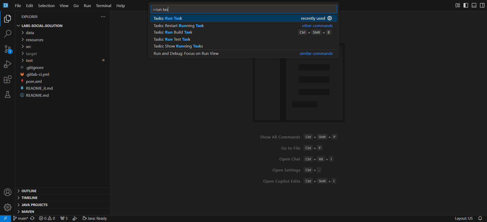
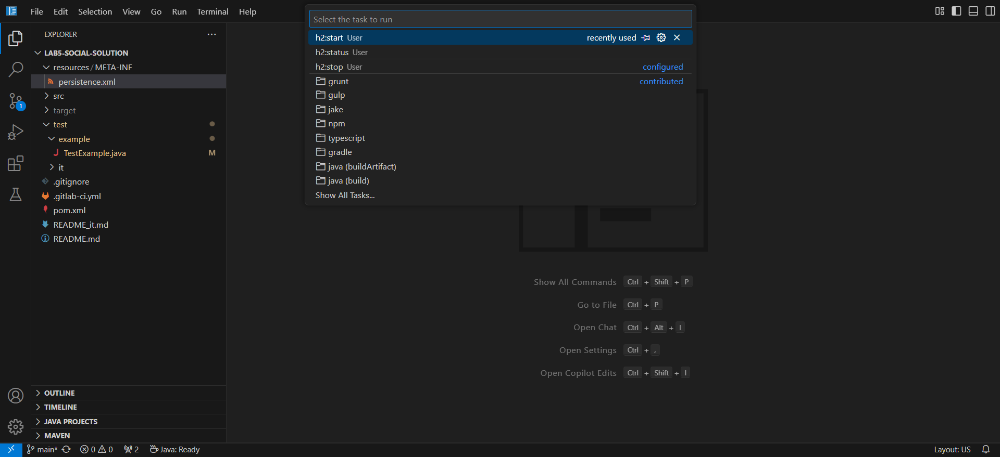
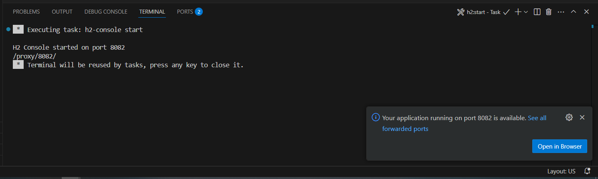
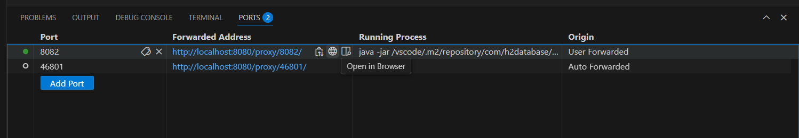
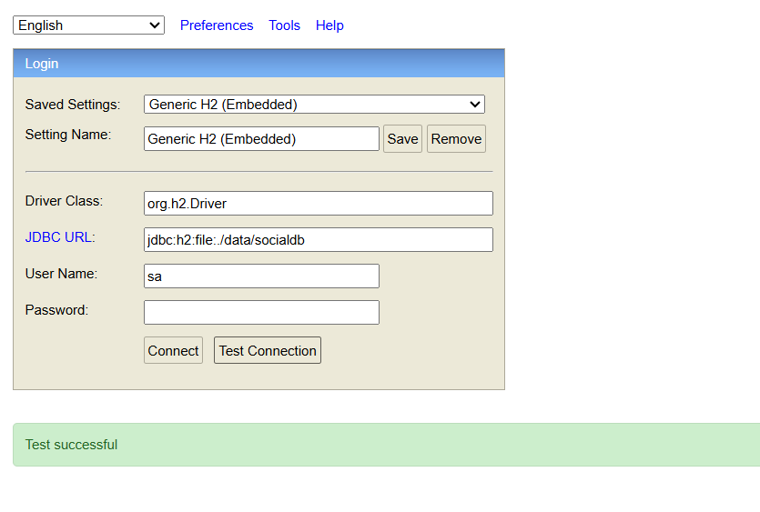

# H2 Console in VS Code (code-server)

You can manage the **H2 Console** directly from VS Code using preconfigured tasks.  
The **in-memory database** (`jdbc:h2:mem:...`) is **not easily inspectable** via the console. Only **file-based databases** are easily accessible.

## Available Tasks

- `h2:start` → starts the H2 Console (web) on port **8082**
- `h2:status` → shows whether the console is running
- `h2:stop` → stops the console

## How to use the H2 Console

1. Open the Command Palette (`Ctrl+Shift+P`) and select **Tasks: Run Task**.  
   

2. From the list of available tasks, choose **h2:start**.  
   

3. When the task runs, VS Code automatically **forwards port 8082**.  
   

4. Open the **Ports** tab at the bottom of VS Code. Locate **port 8082** and click the **globe icon**.  
   

5. A new browser tab will open with the H2 Console web UI.  
   

## Connecting from the H2 Console

- **File-based database** (recommended for inspection):

```
JDBC URL: jdbc:h2:file:./data/socialdb
User: sa
Password: (empty)
```

Depending on how the project was cloned on the VS Code server, the database URL may need the **path with the project directory**. For example:

```
jdbc:h2:file:./lab5-social/data/socialdb
```

- **In-memory database**  
  Not accessible from the console. It is used only for tests.

## Notes

- You do not need to download or manage the H2 jar manually: the tasks handle it.
- Port forwarding is automatic when you run `h2:start`.
