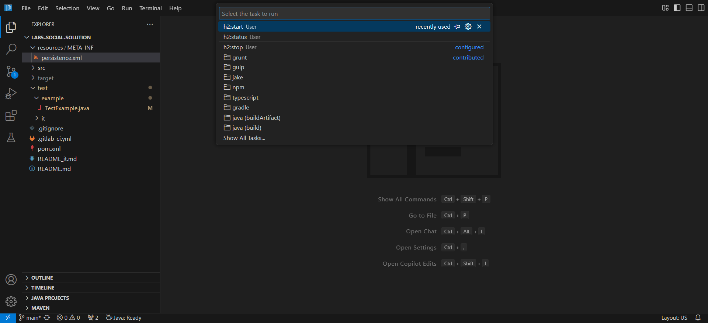
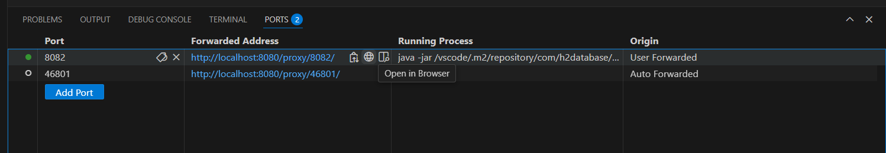
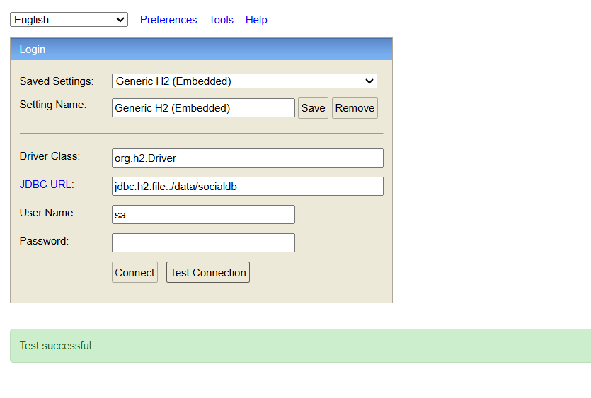

# Console H2 in VS Code (code-server)

Puoi gestire la **H2 Console** direttamente da VS Code con i task già configurati.  
Il **database in-memory** (`jdbc:h2:mem:...`) **non è consultabile facilmente** dalla console. Solo i **database su file** sono facilmente accessibili.

## Task disponibili

- `h2:start` → avvia la H2 Console (web) sulla porta **8082**
- `h2:status` → mostra se la console è in esecuzione
- `h2:stop` → arresta la console

## Come usare la Console H2

1. Apri la Command Palette (`Ctrl+Shift+P`) e scegli **Tasks: Run Task**.  
   

2. Dall’elenco dei task disponibili seleziona **h2:start**.  
   

3. Quando il task parte, VS Code esegue automaticamente il **forward della porta 8082**.  
   

4. Apri il tab **Ports** in basso in VS Code. Trova la **porta 8082** e clicca sull’**icona del globo**.  
   

5. Si aprirà una nuova scheda del browser con l’interfaccia web della console H2.  
   

## Connessione dalla Console H2

- **Database su file** (consigliato per l’ispezione):

```
JDBC URL: jdbc:h2:file:./data/socialdb
User: sa
Password: (empty)
```

In base a come il progetto è stato clonato sul server VS Code, l’URL del database potrebbe richiedere il **percorso contenente la cartella del progetto**. Esempio:

```
jdbc:h2:file:./lab5-social/data/socialdb
```

- **Database in-memory**  
  Non è consultabile dalla console. È usato solo nei test.

## Note

- Non serve scaricare o gestire manualmente il jar di H2: ci pensano i task.
- Il forward della porta avviene automaticamente quando esegui `h2:start`.
